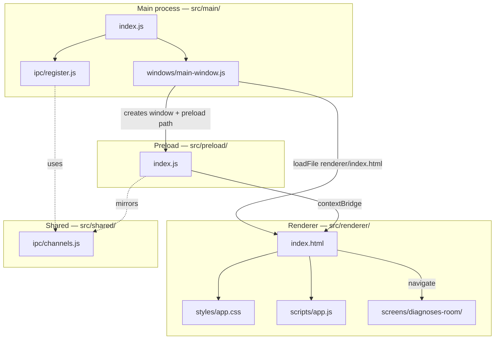
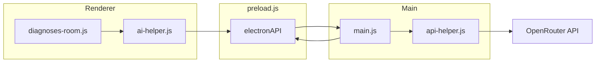

# NeuroAGI — project context

This file is the **handoff / memory** for AI assistants and developers working on this repo. Update it when architecture or workflows change.

**Process note:** Changes made to this codebase (including edits to this file) may be **monitored and reviewed by other agents** or reviewers. Prefer clear commits, accurate updates to this document when behavior changes, and consistency with the conventions described below.

---

## Product intent

**NeuroAGI** is a desktop app (Electron + JavaScript). Current state: **one window**, **two HTML screens**:

- **Home** (`renderer/index.html`) — glass-style UI; entry to the Diagnoses Room.
- **Diagnoses Room** (`renderer/diagnoses-room.html`) — dark, ChatGPT-like **chat UI**: message list, bottom composer, **streaming assistant replies** via **[OpenRouter](https://openrouter.ai/)** (see **Diagnoses Room and OpenRouter**).

There is **no separate backend service** in-repo; the main process calls OpenRouter over HTTPS. No database or clinical data pipeline yet.

---

## Stack

| Layer | Choice |
|--------|--------|
| Runtime | **Electron** (^28, see `package.json`) |
| Language | **JavaScript** (CommonJS `require` in main/preload; ES modules in renderer) |
| UI | **HTML + CSS + JS** under `src/renderer/` (no React/Vue; optional later) |
| Build | None — `npm start` runs Electron via **`scripts/start-electron.js`** |

---

## Project layout (source tree)

```
NeuroAGI/
<<<<<<< HEAD
├── package.json
├── package-lock.json
├── .gitignore
├── README.md
├── CLAUDE.md
├── run.bat
├── install-deps.bat
├── .vscode/
│   └── launch.json              # Debug Main Process
├── scripts/
│   └── start-electron.js        # Spawns Electron cleanly
└── src/
    ├── main/
    │   ├── index.js              # App bootstrap (lifecycle, IPC, window)
    │   ├── ipc/
    │   │   └── register.js       # ipcMain.handle registrations
    │   ├── middleware/            # Business logic (add modules here)
    │   ├── services/             # Helper / data services (add modules here)
    │   └── windows/
    │       └── main-window.js    # BrowserWindow creation + config
    ├── preload/
    │   └── index.js              # contextBridge → window.electronAPI
    ├── renderer/
    │   ├── index.html            # Home screen (glass UI)
    │   ├── screens/
    │   │   └── diagnoses-room/
    │   │       └── index.html    # Diagnoses Room screen
    │   ├── scripts/
    │   │   ├── constants.js      # APP_TITLE, screen names, labels
    │   │   ├── app.js            # Home: title + navigate to diagnoses room
    │   │   └── diagnoses-room.js
    │   ├── styles/
    │   │   └── app.css
    │   └── assets/
    │       ├── images/
    │       ├── fonts/
    │       └── icons/
    └── shared/
        └── ipc/
            └── channels.js       # IPC channel name constants
=======
├── main.js                 # Main process entry (package.json "main"); IPC handlers
├── api-helper.js           # OpenRouter streaming chat (main only; SSE parse)
├── preload.js              # Preload bridge for the renderer
├── package.json
├── README.md               # GitHub / human onboarding (incl. OPENROUTER_API_KEY)
├── .gitignore              # includes node_modules/
├── run.bat
├── install-deps.bat        # Windows: npm.cmd install
├── CLAUDE.md
├── renderer/               # Single “site” loaded by BrowserWindow
│   ├── index.html            # Home (glass UI)
│   ├── diagnoses-room.html   # Chat screen (dark theme; not glass)
│   ├── styles/
│   │   ├── app.css
│   │   └── diagnoses-room.css   # Diagnoses Room only
│   ├── scripts/
│   │   ├── constants.js      # APP_TITLE, screen names, labels
│   │   ├── app.js            # Home: title + navigate to diagnoses room
│   │   ├── ai-helper.js      # Chat orchestration: history + stream → DOM
│   │   └── diagnoses-room.js # Diagnoses Room UI wiring
│   └── assets/
│       ├── images/
│       ├── fonts/
│       └── icons/          # In-app UI icons (not OS installer icons)
├── resources/              # Packager / OS extras (not loaded by loadFile)
│   └── build/              # e.g. app.ico, entitlements when using electron-builder
└── node_modules/           # not in Git; run npm install locally
>>>>>>> aedf3621cbb7ede8f8bae83f0c3e4142daec4cb9
```

| Path | Purpose |
|------|---------|
<<<<<<< HEAD
| `package.json` | `name`: `neuro-agi`; `main`: `src/main/index.js`; `scripts.start`: `node scripts/start-electron.js` |
| `scripts/start-electron.js` | Spawns Electron cleanly (clears `ELECTRON_RUN_AS_NODE`, inherits stdio) |
| `src/main/index.js` | App bootstrap: hide menu, register IPC, create window; macOS re-activate; quit on all windows closed |
| `src/main/windows/main-window.js` | Creates `BrowserWindow` (800×600, hidden until ready, then show+focus); preload + `contextIsolation`; loads `src/renderer/index.html` |
| `src/main/ipc/register.js` | All `ipcMain.handle` routes (currently: `ping`) |
| `src/main/middleware/` | Business logic modules (add as features grow) |
| `src/main/services/` | Helper / data service modules (add as features grow) |
| `src/preload/index.js` | `contextBridge.exposeInMainWorld('electronAPI', …)` |
| `src/shared/ipc/channels.js` | Shared IPC channel name constants |
| `src/renderer/index.html` | Home screen; glass UI; `type="module"` → `scripts/app.js` |
| `src/renderer/screens/diagnoses-room/index.html` | Diagnoses Room screen; link back to `../../index.html` |
| `src/renderer/scripts/constants.js` | Shared strings: **`APP_TITLE`**, **`SCREEN_DIAGNOSES_ROOM`**, button label |
| `src/renderer/styles/` | Stylesheets |
| `src/renderer/scripts/*.js` | ES modules (`import` from `constants.js`); no Node in renderer |
| `src/renderer/assets/images/` | Images; **`logo.png`** is the window / taskbar / Dock icon via `main-window.js` |
| `src/renderer/assets/fonts/` | Webfonts |
| `src/renderer/assets/icons/` | SVG/PNG icons for the UI |
| `.vscode/launch.json` | Debug Main Process (Electron from `node_modules`) |
=======
| `package.json` | `name`: `neuro-agi`; `main`: `main.js`; **`scripts.start`**: `node ./node_modules/electron/cli.js .` |
| `main.js` | Main process: lifecycle, `loadFile` → `renderer/index.html`; window **`icon`** + macOS **`app.dock.setIcon`**; **IPC** for OpenRouter stream (see **Diagnoses Room and OpenRouter**) |
| `api-helper.js` | **`streamChat(messages, onDelta, onDone, onError)`** — `fetch` OpenRouter `chat/completions` with **`stream: true`**, parse SSE; model constant **`OPENROUTER_MODEL`**; reads **`process.env.OPENROUTER_API_KEY`** |
| `preload.js` | **`contextBridge.exposeInMainWorld('electronAPI', { openRouterChatStream })`** |
| `renderer/index.html` | Home screen; glass UI; `type="module"` → `scripts/app.js` |
| `renderer/diagnoses-room.html` | Diagnoses Room: dark chat layout; CSP same family as home; **`styles/diagnoses-room.css`** only |
| `renderer/styles/diagnoses-room.css` | Black/near-black theme, bubbles, composer |
| `renderer/scripts/ai-helper.js` | **`createAiChat({ messagesEl, onStreamingChange })`** — conversation array, calls **`electronAPI.openRouterChatStream`**, updates assistant bubble from stream |
| `renderer/scripts/diagnoses-room.js` | Titles, composer, Enter/send, **`AiHelper`** integration |
| `renderer/scripts/constants.js` | Shared strings: **`APP_TITLE`**, **`SCREEN_DIAGNOSES_ROOM`**, button label |
| `renderer/styles/app.css` | Home / glass theme |
| `renderer/scripts/*.js` (modules) | ES modules (`import` from `constants.js`); no Node in renderer |
| `renderer/assets/images/` | Images; **`logo.png`** is the **window / taskbar / Dock** icon via `main.js` (also usable in HTML as `assets/images/logo.png`) |
| `renderer/assets/fonts/` | Webfonts |
| `renderer/assets/icons/` | SVG/PNG icons for the UI |
| `resources/build/` | Reserved for installer branding / platform files when packaging |
>>>>>>> aedf3621cbb7ede8f8bae83f0c3e4142daec4cb9
| `run.bat` | Windows: `npm.cmd start` + `pause` (avoids PowerShell blocking `npm.ps1`) |
| `install-deps.bat` | Windows: `npm.cmd install` + `pause` |
| `.gitignore` | `node_modules/`, `dist/`, `out/`, `*.log`, `.DS_Store` |
| `README.md` | Public repo overview, install, troubleshooting |
| `CLAUDE.md` | This file |

---

## Requirements

- **Node.js** LTS (18+ recommended)
- **npm** (ships with Node)
- **OpenRouter** (optional for Diagnoses Room): an API key in **`OPENROUTER_API_KEY`** when exercising chat; see **`README.md`**

---

## How to run

Project folder path may include spaces—quote paths in shells.

```powershell
cd "D:\Projects\37. Open Health"
npm install   # first time or after clone / pull
npm start
```

**Windows — batch files (recommended if PowerShell blocks npm):**

- **`install-deps.bat`**: `npm.cmd install` from project root.
- **`run.bat`**: `npm.cmd start` then `pause` so errors stay visible.

**Why `npm.cmd`:** Some Windows setups disable running scripts, so **`npm`** in **PowerShell** tries **`npm.ps1`** and fails with *"running scripts is disabled"*. **`npm.cmd`** (or **Command Prompt**) avoids that. **`run.bat`** / **`install-deps.bat`** call **`npm.cmd`** explicitly.

**PowerShell alternatives:** `npm.cmd install` / `npm.cmd start`, or `Set-ExecutionPolicy -Scope CurrentUser -ExecutionPolicy RemoteSigned`.

**Direct Electron (e.g. GPU issues), from project root:**

```powershell
node ./node_modules/electron/cli.js . --disable-gpu
```

Human-facing steps are also in **[README.md](README.md)**.

---

## Electron architecture (how pieces fit)



- **Main process** (`src/main/`): `index.js` bootstraps; `windows/` creates BrowserWindow; `ipc/` registers handlers; `middleware/` and `services/` hold business logic.
- **Renderer** (`src/renderer/`): sandboxed; **`nodeIntegration: false`** so no raw `require` in the page.
- **Preload** (`src/preload/`): runs before the page; use **`contextBridge.exposeInMainWorld`** for `window.electronAPI`.
- **Shared** (`src/shared/`): constants and types used by both main and preload (IPC channels, enums, DTOs).

---

## Diagnoses Room and OpenRouter

**Flow:** User sends a message in the renderer → **`ai-helper.js`** appends a user bubble and calls **`window.electronAPI.openRouterChatStream({ messages, onChunk, onDone, onError })`** → preload **`ipcRenderer.send('openrouter-stream-start', { requestId, messages })`** → **`main.js`** **`ipcMain.on('openrouter-stream-start', …)`** calls **`api-helper.js`** **`streamChat`** → OpenRouter HTTPS stream → main **`event.sender.send('openrouter-stream-event', { requestId, type: 'chunk'|'done'|'error', … })`** → preload forwards to callbacks → **`ai-helper`** updates the assistant bubble text (and history).

**Secrets:** **`OPENROUTER_API_KEY`** is read **only in the main process** (`api-helper.js`).
Set it either via:
- environment variable **`OPENROUTER_API_KEY`** before **`npm start`**, or
- create a git-ignored `OPENROUTER_API_KEY.txt` in the repo root (single line; never commit real keys).

**Model:** Default model id is **`OPENROUTER_MODEL`** in **`api-helper.js`** (change in one place).



### IPC channels (main ↔ renderer)

| Channel / pattern | Direction | Purpose |
|-------------------|-----------|---------|
| **`openrouter-stream-start`** | Renderer → main (`send` with `{ requestId, messages }`) | Start streaming completion; **`messages`** is `{ role, content }[]`. |
| **`openrouter-stream-event`** | Main → renderer (`send` to sender) | Stream lifecycle: **`chunk`** (delta text), **`done`**, **`error`** (message string); all include **`requestId`**. |

### `window.electronAPI` (preload)

| Method | Behavior |
|--------|----------|
| **`openRouterChatStream({ messages, onChunk, onDone, onError })`** | Registers listener for **`openrouter-stream-event`**, sends **`openrouter-stream-start`**, removes listener on **done** / **error**. Returns a **cleanup** function (v1: optional; does not abort the HTTP stream). |

---

## Security conventions (do not weaken casually)

- **`contextIsolation: true`**, **`nodeIntegration: false`**
<<<<<<< HEAD
- **Paths**: `path.join(__dirname, ...)` so paths with spaces and packaging work.
- **CSP** on `src/renderer/index.html`: `default-src 'self'; script-src 'self'; style-src 'self'`. Adjust if you add inline scripts/styles or external URLs.
- For main ↔ renderer communication, use **`ipcMain` / `ipcRenderer`** with channels exposed only through **`src/preload/index.js`**.
- IPC channel names are centralized in **`src/shared/ipc/channels.js`**; preload mirrors them (cannot reliably `require` shared modules with sandbox on).
=======
- **Paths**: `path.join(__dirname, 'renderer', 'index.html')` and `path.join(__dirname, 'preload.js')` so paths with spaces and packaging work.
- **CSP** on **`renderer/index.html`** and **`renderer/diagnoses-room.html`**: `default-src 'self'; script-src 'self'; style-src 'self'`. No inline **scripts**. Adjust if you add inline scripts, CDNs, or `eval`.
- For main ↔ renderer communication, use **`ipcMain` / `ipcRenderer`** with channels exposed only through **`preload.js`**.
- **Do not** move **`OPENROUTER_API_KEY`** into the renderer or preload source; keep network + key in **main**.
>>>>>>> aedf3621cbb7ede8f8bae83f0c3e4142daec4cb9

---

## Window behavior (`src/main/windows/main-window.js`)

- Default size **800×600**.
- **`show: false`** until `ready-to-show`, then **`show()`** and **`focus()`**.
- **Menu hidden** (`autoHideMenuBar: true` + `setMenuBarVisibility(false)` + `Menu.setApplicationMenu(null)` in bootstrap).
- **`activate`** (macOS): recreate window if none.
- **`window-all-closed`**: on Windows/Linux, **`app.quit()`**; on macOS, app often stays running until explicit quit.

---

## App icon and branding

| Concern | How it works in this repo |
|---------|----------------------------|
| **Window / taskbar (Windows, Linux)** | **`BrowserWindow`** **`icon`** set to **`src/renderer/assets/images/logo.png`** in `main-window.js`. |
| **macOS Dock** | In **`ready-to-show`** callback, **`app.dock.setIcon(iconPath)`** when **`process.platform === 'darwin'`**. |
| **Logo inside the page** | Optional **``** in `src/renderer/index.html`. |
| **`.exe` / installer icon** | Add a multi-size **`.ico`** and point **electron-builder** (or similar) at it when packaging is added. |

---

## Extending the app

| Goal | Where to work |
|------|----------------|
<<<<<<< HEAD
| New screen | `src/renderer/screens/<name>/index.html` + script in `src/renderer/scripts/` |
| New UI on home | `src/renderer/index.html`, `src/renderer/styles/app.css`, `src/renderer/scripts/app.js` |
| Static assets | `src/renderer/assets/images|fonts|icons/` (paths relative to HTML file) |
| New IPC channel | Add to `src/shared/ipc/channels.js`, mirror in `src/preload/index.js`, handle in `src/main/ipc/register.js` |
| Business logic | `src/main/middleware/` (called from IPC handlers) |
| Data / helper services | `src/main/services/` |
| Safe APIs for the page | `src/preload/index.js` + handlers in `src/main/ipc/register.js` |
| OS menus, shortcuts, second windows | `src/main/` |

Current **`window.electronAPI`**: `ping` method (placeholder) in `src/preload/index.js`.
=======
| New UI (home) | `renderer/index.html`, `renderer/styles/app.css`, `renderer/scripts/app.js` |
| Diagnoses Room chat UI | `renderer/diagnoses-room.html`, `renderer/styles/diagnoses-room.css`, `renderer/scripts/diagnoses-room.js` |
| Chat logic (history, bubbles, stream wiring) | `renderer/scripts/ai-helper.js` |
| OpenRouter / HTTP stream | `api-helper.js` + IPC in `main.js` |
| Static assets | `renderer/assets/images|fonts|icons/` (paths relative to each HTML file) |
| Safe APIs for the page | `preload.js` + handlers in `main.js` |
| OS menus, shortcuts, second windows | `main.js` |
| Installer / EXE icons, platform extras | `resources/build/` (e.g. `app.ico`, entitlements) + packager (e.g. **electron-builder**); see **App icon and branding** |

See **`window.electronAPI`** in **Diagnoses Room and OpenRouter**.
>>>>>>> aedf3621cbb7ede8f8bae83f0c3e4142daec4cb9

---

## Production readiness (architecture vs shipping)

### Solid for real apps (keep)

| Area | Notes |
|------|--------|
| **`src/` source tree** | Clean separation: main, preload, renderer, shared. |
| **Main + preload + shared isolation** | Each concern in its own folder under `src/`. |
| **Isolation + CSP** | Aligns with current Electron guidance. |
| **IPC channels centralized** | `src/shared/ipc/channels.js` — single source of truth. |

### Still needed before "production ship"

| Gap | Typical next step |
|-----|-------------------|
| **No installer / bundle** | Add **electron-builder**, **electron-forge**, or equivalent. |
| **No auto-update** | Plan **electron-updater** or vendor store updates once installers exist. |
<<<<<<< HEAD
| **Dev vs prod** | Disable **DevTools** and trim menus when `app.isPackaged` or `NODE_ENV === 'production'`. |
| **`electron` in `devDependencies`** | Already correct for development; bundler strips it for distribution. |
| **Quality / CI** | Linting, tests, and CI are not in scope yet. |
| **Regulated / clinical data** | If the app handles real PHI, compliance (encryption, audit, BAAs, etc.) is separate from architecture. |
=======
| **Dev vs prod** | e.g. disable **DevTools** shortcut / menu and trim menus when **`app.isPackaged`** or **`NODE_ENV === 'production'`**. |
| **`electron` in `dependencies`** | Some teams move Electron to **`devDependencies`** when only the **built** artifact is distributed; both patterns exist. |
| **Quality / CI** | Linting, tests, and CI are not in scope of the folder tree but matter for serious releases. |
| **Regulated / clinical data** | If the app handles real PHI or similar, **compliance** (encryption, audit, BAAs, etc.) is separate from this architecture doc. |

### Optional hardening (later)

- Consider **`sandbox: true`** in `webPreferences` when preload + IPC are stable (can interact with preload capabilities).
- **Pin Electron** (exact version or controlled lockfile bumps) near release so CI and users don’t drift on `^`.
>>>>>>> aedf3621cbb7ede8f8bae83f0c3e4142daec4cb9

---

## Dependencies

- **`electron`** — only dependency in `package.json` (`devDependencies`).

---

## Troubleshooting

| Symptom | What to try |
|---------|----------------|
| **`npm` / "running scripts is disabled"** (PowerShell) | Use **`npm.cmd`**, **Command Prompt**, **`install-deps.bat`** / **`run.bat`**, or relax execution policy for **CurrentUser** |
| **`electron` is not recognized** | Run **`npm install`**; start script uses `scripts/start-electron.js` which requires Electron from `node_modules` |
| Git push rejected — **large file** / **`electron.exe`** | **`node_modules`** was committed by mistake; keep **`node_modules/`** in **`.gitignore`** |
| Terminal opens and closes immediately | Use **`run.bat`** or a persistent terminal |
| Window does not appear | `node ./node_modules/electron/cli.js . --disable-gpu`; check console for load errors |
| **`npm` not found** | Install Node LTS; reopen terminal |
<<<<<<< HEAD
| CSS/JS not loading | Paths relative to the HTML file loading them; CSP includes `style-src 'self'` |
=======
| CSS/JS not loading | Paths relative to `renderer/index.html`; CSP includes `style-src 'self'` |
| **Diagnoses Room / OpenRouter errors** | Set **`OPENROUTER_API_KEY`** (env var or `OPENROUTER_API_KEY.txt` in repo root; see **`README.md`**); check main console for network errors; model id in **`api-helper.js`**. |
| Icon not updating | Fully quit the app; Windows taskbar may cache icons |
>>>>>>> aedf3621cbb7ede8f8bae83f0c3e4142daec4cb9

---

## Changelog (high level)

- Scaffold: Electron + preload + CSP, `run.bat`.
<<<<<<< HEAD
- **Renderer layout:** `renderer/` as web root with `styles/`, `scripts/`, `assets/`.
- **Production readiness** section added.
- **App icon and branding:** `logo.png` wired in `main-window.js`.
- **Two renderer screens:** home (`index.html`) → `screens/diagnoses-room/index.html`; shared `constants.js`.
- **Git / Windows:** `.gitignore`, `install-deps.bat`, `run.bat`, `npm.cmd` pattern.
- **README.md** for GitHub onboarding; **CLAUDE.md** for project context.
- **Project rename:** product and UI title **NeuroAGI**; npm package name **`neuro-agi`**.
- **Restructured to `src/` layout** (following Flowter template): `src/main/` (index, ipc, windows, middleware, services), `src/preload/`, `src/renderer/` (with `screens/` for additional pages), `src/shared/` (IPC channels). Added `scripts/start-electron.js`, `.vscode/launch.json`. Electron moved to `devDependencies`.
=======
- **Renderer layout:** `renderer/` as web root (`index.html`, `styles/`, `scripts/`, `assets/`); `main.js` loads `renderer/index.html`; `resources/build/` for future packaging.
- **Production readiness** section: what the architecture already supports vs gaps before shipping (packaging, signing, updates, prod toggles, compliance caveat).
- **App icon and branding:** `renderer/assets/images/logo.png` wired in `main.js` (`BrowserWindow` `icon`, macOS `app.dock.setIcon`); packaged EXE uses `resources/build/` + builder when added.
- **Two renderer screens:** home (`index.html`) → `diagnoses-room.html`; shared **`constants.js`** for titles/labels; glass UI theme in `app.css`.
- **Git / Windows:** **`.gitignore`** → `node_modules/`; history rewrite if large files were pushed; **`install-deps.bat`**, **`run.bat`** + **`npm.cmd`**; **`start`** script → **`node ./node_modules/electron/cli.js .`**.
- **`README.md`** for GitHub onboarding; **`CLAUDE.md`** for deep project context.
- **Project rename:** product and UI title **NeuroAGI**; npm package name **`neuro-agi`** (`package.json` / lockfile).
- **Diagnoses Room chat:** dark **`diagnoses-room.css`** theme; **`ai-helper.js`** + **`api-helper.js`**; OpenRouter streaming over **IPC**; **`OPENROUTER_API_KEY`** in main only; **`README.md`** env instructions.
>>>>>>> aedf3621cbb7ede8f8bae83f0c3e4142daec4cb9
