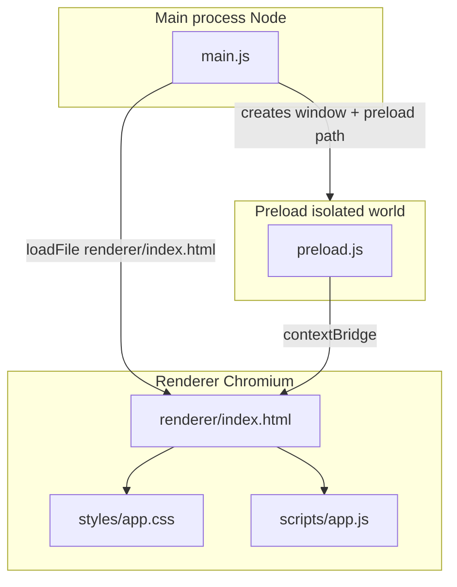

# Open Health — project context

This file is the **handoff / memory** for AI assistants and developers working on this repo. Update it when architecture or workflows change.

**Process note:** Changes made to this codebase (including edits to this file) may be **monitored and reviewed by other agents** or reviewers. Prefer clear commits, accurate updates to this document when behavior changes, and consistency with the conventions described below.

---

## Product intent

**Open Health** is a desktop app (name and domain TBD as features grow). Current state: **minimal Electron shell** — one window, **two HTML screens** (home + Diagnoses Room), glass UI. No backend, database, or health data yet.

---

## Stack

| Layer | Choice |
|--------|--------|
| Runtime | **Electron** (^28, see `package.json`) |
| Language | **JavaScript** (CommonJS `require` in main/preload) |
| UI | **HTML + CSS + JS** under `renderer/` (no React/Vue; optional later) |
| Build | None — run with `electron .` |

---

## Project layout (source tree)

```
Open Health/
├── main.js                 # Main process entry (package.json "main")
├── preload.js              # Preload bridge for the renderer
├── package.json
├── run.bat
├── CLAUDE.md
├── renderer/               # Single “site” loaded by BrowserWindow
│   ├── index.html            # Home (glass UI)
│   ├── diagnoses-room.html   # Second screen
│   ├── styles/
│   │   └── app.css
│   ├── scripts/
│   │   ├── constants.js      # APP_TITLE, screen names, labels
│   │   ├── app.js            # Home: title + navigate to diagnoses room
│   │   └── diagnoses-room.js
│   └── assets/
│       ├── images/
│       ├── fonts/
│       └── icons/          # In-app UI icons (not OS installer icons)
├── resources/              # Packager / OS extras (not loaded by loadFile)
│   └── build/              # e.g. app.ico, entitlements when using electron-builder
└── node_modules/
```

| Path | Purpose |
|------|---------|
| `package.json` | `name`: `open-health`; `main`: `main.js`; `scripts.start`: `electron .` |
| `main.js` | Main process: lifecycle, `loadFile` → `renderer/index.html`; window **`icon`** + macOS **`app.dock.setIcon`** (see **App icon and branding**) |
| `preload.js` | `contextBridge.exposeInMainWorld('electronAPI', …)` |
| `renderer/index.html` | Home screen; glass UI; `type="module"` → `scripts/app.js` |
| `renderer/diagnoses-room.html` | Second screen (“Diagnoses Room”); link back to `index.html` |
| `renderer/scripts/constants.js` | Shared strings: **`APP_TITLE`**, **`SCREEN_DIAGNOSES_ROOM`**, button label |
| `renderer/styles/` | Stylesheets |
| `renderer/scripts/*.js` | ES modules (`import` from `constants.js`); no Node in renderer |
| `renderer/assets/images/` | Images; **`logo.png`** is the **window / taskbar / Dock** icon via `main.js` (also usable in HTML as `assets/images/logo.png`) |
| `renderer/assets/fonts/` | Webfonts |
| `renderer/assets/icons/` | SVG/PNG icons for the UI |
| `resources/build/` | Reserved for installer branding / platform files when packaging |
| `run.bat` | Windows launcher with `pause` |
| `CLAUDE.md` | This file |

---

## Requirements

- **Node.js** LTS (18+ recommended)
- **npm** (ships with Node)

---

## How to run

Project folder name includes a space (`Open Health`). Always quote paths in shells.

```powershell
cd "C:\Users\User\Desktop\Open Health"
npm install   # first time or after pulling changes
npm start
```

**`run.bat`** (project root): `cd /d "%~dp0"` → `npm start` → `pause` so a double-clicked window stays open on errors.

**Direct Electron (e.g. GPU issues):**

```powershell
npx electron . --disable-gpu
```

---

## Electron architecture (how pieces fit)



- **Main process** only: `main.js`. Can use Node APIs and `electron` modules fully.
- **Renderer** (the page): sandboxed; **`nodeIntegration: false`** so no raw `require` in the page.
- **Preload** runs before the page; use **`contextBridge.exposeInMainWorld`** for `window.electronAPI`.

---

## Security conventions (do not weaken casually)

- **`contextIsolation: true`**, **`nodeIntegration: false`**
- **Paths**: `path.join(__dirname, 'renderer', 'index.html')` and `path.join(__dirname, 'preload.js')` so paths with spaces and packaging work.
- **CSP** on `renderer/index.html`: `default-src 'self'; script-src 'self'; style-src 'self'`. Adjust if you add inline scripts/styles or external URLs.
- For main ↔ renderer communication, use **`ipcMain` / `ipcRenderer`** with channels exposed only through **`preload.js`**.

---

## Window behavior (`main.js`)

- Default size **800×600**.
- **`show: false`** until `loadFile(...)` resolves, then **`show()`** and **`focus()`**.
- **`activate`** (macOS): recreate window if none.
- **`window-all-closed`**: on Windows/Linux, **`app.quit()`**; on macOS, app often stays running until explicit quit.

---

## App icon and branding

| Concern | How it works in this repo |
|---------|----------------------------|
| **Window / taskbar (Windows, Linux)** | **`BrowserWindow`** **`icon`** is set to **`path.join(__dirname, 'renderer', 'assets', 'images', 'logo.png')`** in `main.js`. |
| **macOS Dock** | In **`app.whenReady()`**, **`app.dock.setIcon(iconPath)`** when **`process.platform === 'darwin'`**. |
| **Logo inside the page** | Optional **``** in `renderer/index.html` (same file; not automatic from `BrowserWindow` icon). |
| **`.exe` / installer icon (packaged app)** | **`BrowserWindow` `icon`** does not set the built executable icon. Add a multi-size **`.ico`** (Windows) under **`resources/build/`** and point **electron-builder** (or similar) at it (e.g. **`build.win.icon`**) when packaging is added. |

Electron accepts **PNG** for `icon` on many platforms; **ICO** is often recommended for Windows taskbar fidelity at install time.

---

## Extending the app

| Goal | Where to work |
|------|----------------|
| New UI | `renderer/index.html`, `renderer/styles/app.css`, `renderer/scripts/app.js` |
| Static assets | `renderer/assets/images|fonts|icons/` (paths relative to `index.html`) |
| Safe APIs for the page | `preload.js` + handlers in `main.js` |
| OS menus, shortcuts, second windows | `main.js` |
| Installer / EXE icons, platform extras | `resources/build/` (e.g. `app.ico`, entitlements) + packager (e.g. **electron-builder**); see **App icon and branding** |

Current **`window.electronAPI`**: empty object placeholder in `preload.js`.

---

## Production readiness (architecture vs shipping)

**Summary:** Folder layout, renderer web root, and security defaults (**context isolation**, **no `nodeIntegration`**, **CSP**, **`path.join` for loads**) are **appropriate for a production-oriented Electron app**. The repo is **not** a complete “ship to end users” setup until packaging, distribution, and optional hardening are added.

### Solid for real apps (keep)

| Area | Notes |
|------|--------|
| **`renderer/` as single site** | Clear asset URLs; works with asar; can adopt a bundler later without throwing away the idea. |
| **Main + preload at repo root** | Matches common `package.json` `"main": "main.js"` patterns. |
| **Isolation + CSP** | Aligns with current Electron guidance; revisit CSP if adding inline scripts, CDNs, or `eval`. |
| **`resources/build/`** | Correct place for **electron-builder** (or similar) icons, Windows/macOS metadata. |

### Still needed before “production ship”

| Gap | Typical next step |
|-----|-------------------|
| **No installer / bundle** | Add **electron-builder**, **electron-forge**, or equivalent → `.exe` / `.msi` / `.dmg`, optional **code signing**. |
| **No auto-update** | Plan **electron-updater** or vendor store updates once installers exist. |
| **Dev vs prod** | e.g. disable **DevTools** and trim menus when `app.isPackaged` or `NODE_ENV === 'production'`. |
| **`electron` in `dependencies`** | Some teams move Electron to **`devDependencies`** when only the **built** artifact is distributed; both patterns exist. |
| **Quality / CI** | Linting, tests, and CI are not in scope of the folder tree but matter for serious releases. |
| **Health / regulated data** | If the app handles real PHI or similar, **compliance** (encryption, audit, BAAs, etc.) is separate from this architecture doc. |

### Optional hardening (later)

- Consider **`sandbox: true`** in `webPreferences` when preload + IPC are stable (can interact with preload capabilities).
- **Pin Electron** (exact version or controlled lockfile bumps) near release so CI and users don’t drift on `^`.

---

## Dependencies

- **`electron`** — only direct dependency in `package.json` (see **Production readiness** for `dependencies` vs `devDependencies` when packaging).

---

## Troubleshooting

| Symptom | What to try |
|---------|----------------|
| Terminal opens and closes immediately | Run from PowerShell or use `run.bat` |
| Window does not appear | `npx electron . --disable-gpu`; check console for load errors |
| `npm` / `electron` not found | Install Node LTS; reopen terminal; `npm install` in project root |
| CSS/JS not loading | Confirm `href`/`src` paths are relative to `renderer/index.html`; CSP includes `style-src 'self'` |
| Icon not updating | Fully quit the app and restart; on Windows, taskbar may cache icons |

---

## Changelog (high level)

- Scaffold: Electron + preload + CSP, `run.bat`.
- **Renderer layout:** `renderer/` as web root (`index.html`, `styles/`, `scripts/`, `assets/`); `main.js` loads `renderer/index.html`; `resources/build/` for future packaging.
- **Production readiness** section: what the architecture already supports vs gaps before shipping (packaging, signing, updates, prod toggles, compliance caveat).
- **App icon and branding:** `renderer/assets/images/logo.png` wired in `main.js` (`BrowserWindow` `icon`, macOS `app.dock.setIcon`); packaged EXE uses `resources/build/` + builder when added.
- **Two renderer screens:** home (`index.html`) → `diagnoses-room.html`; shared **`constants.js`** for titles/labels; glass UI theme in `app.css`.
